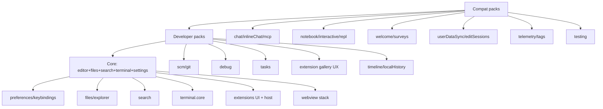

# Performance Fork — Architecture Audit

> Repository intelligence pass for the byronwade/vscode performance fork.
> Goal: melt stock VS Code into a minimal, fast, extension-compatible IDE without blind folder deletion.

## Executive summary

VS Code boots by **side-effect importing** nearly every workbench contribution from two entrypoints:

| Entrypoint | Role |
|---|---|
| `src/vs/workbench/workbench.common.main.ts` | Shared desktop + web contribution surface (~90+ contrib imports) |
| `src/vs/workbench/workbench.desktop.main.ts` | Electron delta (native services + desktop-only contribs) |

The Electron renderer loads `workbench.desktop.main.js` from `src/vs/code/electron-browser/workbench/workbench.ts`, which re-exports `main` from `electron-browser/desktop.main.ts`. The main process starts in `src/vs/code/electron-main/main.ts` → `app.ts`.

**This fork does not delete contrib folders first.** It gates contribution registration through a feature-flag layer and mode-specific entrypoints (`core` / `developer` / `compat`).

---

## What loads on startup (stock)

### Process graph

```
electron-main (main.ts → CodeApplication)
  ├─ shared process
  ├─ pty host (on demand)
  ├─ extension host (on demand / early for * activations)
  └─ renderer → workbench.desktop.main
        ├─ workbench.common.main
        │    ├─ editor.all
        │    ├─ extensionHost.contribution (main-thread RPC)
        │    ├─ workbench parts (editor, sidebar, statusbar, banner)
        │    ├─ ~70 platform/workbench services
        │    └─ ~90 contrib side-effect imports
        └─ electron-browser services + desktop contribs
```

### Startup-critical (must keep for Core Mode)

- Monaco / `editor.all`
- Workbench layout shell (parts, views service, editor service)
- File service + explorer
- Configuration / settings / keybindings
- Command service + quick input / command palette
- Search service (ripgrep)
- Terminal registration (lean)
- Themes
- Extension scanner metadata (host may stay idle)
- Working copy / text file services

### Loaded on stock startup but not needed for basic editing

| Area | Paths | Action |
|---|---|---|
| Telemetry | `contrib/telemetry`, `contrib/editTelemetry`, `contrib/tags`, `contrib/bracketPairColorizer2Telemetry`, `platform/telemetry` | Gate off |
| Surveys | `contrib/surveys` | Gate off |
| Welcome | `contrib/welcomeGettingStarted`, `welcomeWalkthrough`, `welcomeViews` | Gate off |
| Chat / AI | `contrib/chat`, `inlineChat`, services `ai*`, `chatEntitlementService` | Gate off |
| MCP | `contrib/mcp`, MCP services | Gate off |
| Notebook | `contrib/notebook`, `interactive`, `replNotebook` | Gate off |
| Testing | `contrib/testing` | Gate off |
| Remote tunnel | `contrib/remoteTunnel` | Gate off |
| Remote coding agents | `contrib/remoteCodingAgents` | Gate off |
| User data sync | `contrib/userDataSync` | Gate off |
| Edit sessions | `contrib/editSessions` | Gate off |
| Profiles UI | `contrib/userDataProfile` | Gate (keep service stubs) |
| Search editor | `contrib/searchEditor` | Gate |
| Timeline / local history | `contrib/timeline`, `localHistory` | Gate |
| Share / issue / process explorer | respective contribs | Gate |
| Extension tips/recommendations | tips services + settings | Gate via defaults |
| Accessibility *signals* | `contrib/accessibilitySignals` | Gate (keep `contrib/accessibility`) |

---

## Main desktop entrypoints

| File | Notes |
|---|---|
| `src/vs/code/electron-main/main.ts` | Process entry, single-instance, services |
| `src/vs/code/electron-main/app.ts` | Windows, IPC, shared process, telemetry wiring |
| `src/vs/code/electron-browser/workbench/workbench.ts` | Renderer bootstrap, dynamic import of workbench |
| `src/vs/workbench/electron-browser/desktop.main.ts` | `DesktopMain.open()` → `Workbench.startup()` |
| `src/vs/workbench/workbench.desktop.main.ts` | Desktop contribution + service imports |
| `src/vs/workbench/workbench.common.main.ts` | Shared contribution surface |

### Performance-fork split (this branch)

| File | Mode |
|---|---|
| `workbench.core.main.ts` | Always — minimal contrib set |
| `workbench.developer.main.ts` | Developer packs (SCM/debug/tasks/…) |
| `workbench.compat.main.ts` | Stock-like packs (chat/notebook/welcome/…) |
| `workbench.featureRegistry.ts` | Pack ↔ feature-flag map |
| `contrib/terminal/terminal.core.ts` | Lean terminal contrib set |

---

## Extension host entrypoints

| File | Role |
|---|---|
| `workbench/api/node/extensionHostProcess.ts` | Child process entry |
| `workbench/api/common/extensionHostMain.ts` | Host runtime |
| `workbench/api/common/extHostExtensionService.ts` | Activation / module load |
| `workbench/api/common/extHost.api.impl.ts` | `vscode` API |
| `workbench/api/browser/extensionHost.contribution.ts` | Main-thread participants |

Activation budget API (new): `workbench/services/extensions/common/extensionActivationBudget.ts`.

---

## Terminal stack

| Piece | Path |
|---|---|
| Aggregator | `contrib/terminal/terminal.all.ts` (stock) / `terminal.core.ts` (fork) |
| UI | `contrib/terminal/browser/terminal*.ts` |
| xterm | `browser/xterm/xtermTerminal.ts`, `xtermAddonImporter.ts` (already lazy) |
| PTY | `platform/terminal/node/ptyHostMain.ts`, `node-pty` |
| Shell integration | `platform/terminal/common/xterm/shellIntegrationAddon.ts` |

See `terminal-performance.md`.

---

## Search stack

| Piece | Path |
|---|---|
| UI | `contrib/search/browser/*` |
| Service | `services/search/electron-browser/searchService.ts` |
| Engine | `services/search/node/ripgrep*.ts` (`@vscode/ripgrep`) |

---

## Built-in extensions

- Local: `extensions/*` (grammars, language features, themes, git, notebooks, …)
- Marketplace built-ins: `product.json` → `builtInExtensions`
- Packaging: `build/lib/extensions.ts`, `build/lib/builtInExtensions.ts`

Core Mode sets `builtInExtensions: []`. Debug companions moved under `builtInExtensionsByMode.developer|compat`.

See `builtin-extension-audit.md`.

---

## Product configuration

`product.json` now includes:

- `enableTelemetry: false`
- `openToWelcomeMainPage: false`
- `performanceFork.mode` / `performanceFork.features`
- empty default `builtInExtensions`
- **no** `defaultChatAgent` in Core product profile

---

## Build / bundling

| Concern | Reality in this tree |
|---|---|
| Dev compile | Gulp + TypeScript (`compile`, `watch-client`) |
| Production bundle | **esbuild** via `build/lib/optimize.ts` (`bundle-vscode`, `minify-vscode`) |
| Built-in extensions | Webpack (`extensions/**/extension.webpack.config.js`) |
| Native TS check | `tsgo` / `@typescript/native-preview` scripts |
| Entry list | `build/buildfile.ts` includes `workbench.desktop.main` |

See `build-system-options.md`. **Do not migrate bundler until Core Mode boots cleanly.**

---

## Contribution registration patterns

- `registerWorkbenchContribution2(id, ctor, WorkbenchPhase | { lazy: true } | { editorTypeId })`
- Phases: `BlockStartup`, `BlockRestore`, `AfterRestored`, `Eventually`
- Legacy: `Registry.as(WorkbenchExtensions.Workbench).registerWorkbenchContribution(...)`
- Also: configuration, views, menus, editor panes registries

**Rule for this fork:** prefer not importing a contribution module at all over registering it as Eventually.

---

## Dependency graph (major workbench packs)



---

## What can be removed safely (after gating)

Safe to **stop importing** in Core Mode (code remains in tree for Compat):

- Telemetry contribs, surveys, welcome*, chat*, mcp*, notebook*, interactive, replNotebook, testing
- remoteTunnel, remoteCodingAgents, userDataSync UI, editSessions, share
- processExplorer / issueReporter (unless developer mode)
- accessibilitySignals (keep accessibility)
- extension tips / recommendations defaults
- terminal chat/voice contribs

## What must be gated instead of deleted

- Webview / custom editor (extension API)
- Extension host + gallery services (DI + marketplace)
- Authentication services (many extensions)
- Notebook *document* service stubs if language features expect them
- Remote services used by tunnel/SSH optional packs
- MCP service singletons (register delayed; don't load contrib UI)

## What breaks extension compatibility

- Removing webview / custom editor / proposed API surfaces
- Changing `vscode.d.ts` / activation event semantics without docs
- Stripping SCM/debug/tasks while claiming Full Compatibility Mode
- Blocking all `*` activations without idle replay

## What breaks marketplace compatibility

- Removing extension gallery service URLs / manifest services
- Incompatible engine version / API proposals
- Missing authentication provider hooks some marketplace extensions need

## What affects Electron packaging

- `product.json` names, protocols, built-in extension download list
- `build/gulpfile.vscode.ts` packaging streams
- Native modules (`node-pty`, ripgrep, sqlite, …)

## What affects smoke tests

- Welcome / startupEditor assumptions
- Chat / notebook smoke coverage
- Telemetry opt-out flows
- Use `--perf-fork-mode=compat` for stock smoke; Core for perf smoke

## What affects built-in language support

- Trimming `extensions/*` language-feature packages
- Empty `builtInExtensions` removes js-debug by default (intentional in Core)

## Safe optional feature packs

| Pack | Flag(s) |
|---|---|
| SCM/Git | `workbench.scm` |
| Debug | `workbench.debug` |
| Tasks | `workbench.tasks` |
| Testing | `workbench.testing` |
| Notebook family | `workbench.notebook` (+ interactive/repl) |
| Chat/MCP | `workbench.chat`, `workbench.mcp` |
| Sync/Profiles | `workbench.userDataSync`, `workbench.userDataProfiles` |
| Remote/Tunnel | `workbench.remote`, `workbench.remoteTunnel` |

---

## Prioritized removal / gating plan

1. **Done (this pass):** feature flags, entrypoint split, Core defaults, telemetry/welcome/chat/MCP/notebook/testing gated off by default, empty marketplace built-ins, perf harness stubs, docs.
2. Wire activation budget into `AbstractExtensionService` activation path.
3. Terminal fast-path: default shell integration off in Core; cache profiles; benchmark.
4. Built-in extension packaging filters by mode.
5. Minimal UI theme/layout polish.
6. Measure with `npm run perf-fork`; only then experiment with bundler changes.
7. Compat mode CI job for extension regression.

## Rollback plan

- Set `performanceFork.mode` to `compat` or launch with `--perf-fork-mode=compat`.
- Restore previous `product.json` `builtInExtensions` / `defaultChatAgent` from git history if needed.
- Entrypoint split is additive; stock imports can be restored by making common.main always import compat packs.
